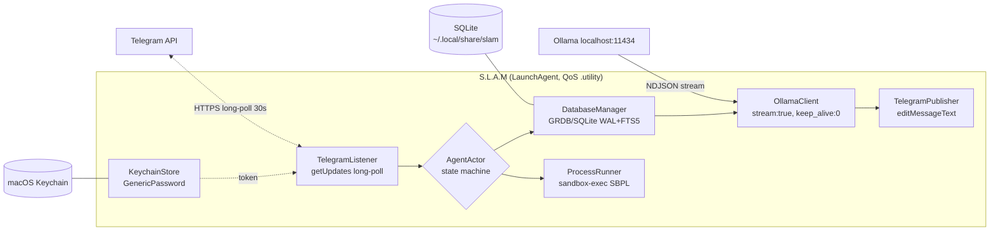

# Specification · S.L.A.M

Native autonomous AI agent for macOS (Apple Silicon). Status: **alpha (0.1.0)** — implemented through the stages below; APIs and sandbox scope may change before 1.0.

**Translations:** [Русский](SPEC.ru.md) · [Srpski](SPEC.sr.md)

This document is the product spec (functional requirements, architecture, non-goals). It is not a session diary.

---

## 1. North-star

One resident macOS process (Apple Silicon, 16 GB class), cheap when idle: RAM ≤ 100 MB, CPU ≲ 1% waiting, work on E-cores where QoS allows. Control is Telegram only. Intelligence is local Ollama (default Qwen 2.5 7B). Memory is SQLite. Model-issued commands run only in a Seatbelt sandbox, with human confirmation for destructive patterns.

## 2. Platform and resource budget

| Parameter | Requirement | How we check |
|---|---|---|
| Platform | macOS, Apple Silicon (M1+, 16 GB unified) | arm64 build |
| Shape | SPM executable, zero GUI | `swift build` without AppKit |
| Idle RAM | ≤ 100 MB RSS | `/status` + Activity Monitor / `footprint` |
| Idle CPU | ≲ 1% (blocked on I/O between long-polls) | multi-minute idle sample |
| Language | Swift 6, `-strict-concurrency=complete`, async/await, actors | `Package.swift`, green `swift build` |
| Dependencies | GRDB.swift only; network / Keychain / processes = native frameworks | `Package.resolved` |
| QoS | Long poll, JSON, SQLite, processes → `.utility`; DB maintenance → `.background`; user message → `.userInitiated` | review |

Competitor RAM claims are vendor numbers. This spec only accepts **our** measurements.

## 3. Architecture



| Module | Kind | Responsibility |
|---|---|---|
| `AgentActor` | actor | daemon state machine, update queue, routing |
| `TelegramListener` | nonisolated service | `getUpdates` loop, backoff, 409 detect |
| `TelegramPublisher` | nonisolated service | `sendMessage` / throttled `editMessageText` |
| `OllamaClient` | nonisolated service | `POST /api/chat`, NDJSON via `URLSession.bytes.lines` |
| `DatabaseManager` | actor | GRDB `DatabasePool`, history, FTS5, quotas, offset |
| `ProcessRunner` | nonisolated service | `Foundation.Process` + `sandbox-exec`, HITL gate |
| `KeychainStore` | struct | SecItem add/update/read of the bot token |
| `MaintenanceLoop` | Task | summarization, checkpoint/vacuum |
| `DaemonMain` | entry | config, Keychain, single-instance lock, start loops |

Concurrency invariant: shared mutable state only inside actors; messages are `Sendable` value types; services are `nonisolated`; no `@MainActor` (headless).

## 4. Functional requirements

### 4.1 Lifecycle

- **FR-1** LaunchAgent `~/Library/LaunchAgents/com.local.slam.plist`: `KeepAlive={SuccessfulExit:false}`, `ThrottleInterval≥10`, `RunAtLoad=true`, `ProcessType=Background`, logs under `~/.local/state/slam/logs/`. Install with `launchctl bootstrap gui/$(id -u)` (`install.sh`). No manual fork/daemonize.
- **FR-2** Single-instance guard: a second process exits with a clear error (file lock). HTTP 409 from Telegram is logged as “another poller”.
- **FR-3** Non-secret config: `~/.config/slam/config.json`. Secrets must not live there.

### 4.2 Telegram

- **FR-4** Native `URLSession` only. Long polling `getUpdates`: `timeout=30`, `allowed_updates`, `offset` persisted in SQLite.
- **FR-5** On start: `getWebhookInfo` → `deleteWebhook` if a webhook is set.
- **FR-6** Backoff on network/API errors: start 2 s, cap 300 s, ×2, **full jitter**.
- **FR-7** Allowlist of Telegram user IDs. First `/start` from a stranger offers pairing; the owner adds IDs with `/allow` or config. Others never reach the model.
- **FR-8** Bot commands: `/start`, `/help`, `/status`, `/model <name>`, `/allow <id>`, `/deny <id>`. Other text is a model turn.
- **FR-9** Streaming: one message, incremental `editMessageText`, throttle ~1.5–2 s. While tokens arrive: `sendChatAction(typing)` ~every 4 s and a cursor `▍` on unfinished text.

### 4.3 Keychain

- **FR-10** Token is read at start from Keychain (`kSecClassGenericPassword`, service `com.local.slam`, account `telegram-bot-token`). Files / plist / env are forbidden.
- **FR-11** Add-or-update: `SecItemAdd` → on duplicate `SecItemUpdate`. CLI: `slam set-token`.

### 4.4 Ollama

- **FR-12** `POST http://localhost:11434/api/chat`, default model `qwen2.5:7b`, `"stream": true`, `"keep_alive": 0` **on every request** (top-level, not inside `options`).
- **FR-13** Stream via `URLSession.bytes(for:)` + NDJSON lines; check HTTP 200 before reading; cancel generation by cancelling the Task.
- **FR-14** Request context: last N session messages + FTS5 snippets + system prompt, truncated to a character budget.
- **FR-15** Idle unloader: after M idle minutes, empty `messages:[]` + `keep_alive: 0`.
- **FR-16** `ModelProvider` protocol over Ollama — room for other providers later. v1 has one implementation.

### 4.5 Database

- **FR-17** GRDB `DatabasePool` (WAL). Migrations via `DatabaseMigrator`.
- **FR-18** v1 tables: `sessions`, `messages` (+ FTS5 unicode61), `kv`, `pending_confirmations`, `meta`.
- **FR-19** Disk quota: min(10% free on the volume, 20 GB). At 85% — background summarization, delete raw rows, `incremental_vacuum`.
- **FR-20** Hourly maintenance (`.background`): `wal_checkpoint(TRUNCATE)`, `incremental_vacuum`, `PRAGMA optimize`.

### 4.6 Commands and sandbox

- **FR-21** Model-driven tools: native Ollama tools (`write_file`, `run_shell`) with a `` ```run `` fence fallback. Execution is `Foundation.Process` + `/usr/bin/sandbox-exec -f <profile.sb> zsh -c "<cmd>"`. `write_file` paths must resolve inside `WORKING_DIR/tmp` (Swift realpath check + SBPL `file-write*`).
- **FR-22** SBPL parameterized with `-D WORKING_DIR=…` / `-D WORKING_TMP=…`: `(deny default)`; read = system libraries + `WORKING_DIR`; **write = `WORKING_DIR/tmp` only**; `(deny network*)`; explicit deny of `~/.ssh`, `~/.aws`, `~/Library/Keychains`, `~/Documents`.

  **Alpha-only write restriction.** The current write scope is a conservative safety default for 0.1.0, not a permanent product limit. Later releases will widen and/or configure the workspace. Do not document it as “the agent can never write elsewhere.”

- **FR-23** Human-in-the-loop: destructive patterns (config list) wait for Telegram inline buttons, 10 minute timeout, then deny. stdout/stderr/exit go to the DB and the chat (trimmed).
- **FR-24** `sandbox-exec` smoke at boot; if it fails, the run-channel stays off and the daemon stays up.

## 5. Non-goals (v1)

- Extra chat networks (Discord, WhatsApp, iMessage, …) — Telegram only; a channel abstraction may exist.
- Telegram webhooks (need a public endpoint; long polling covers the personal-agent case).
- Vector DBs / embeddings — FTS5 is enough at personal scale.
- User-facing cron/SOP scheduler — internal periodic tasks exist; user schedules are backlog.
- GUI, settings windows, cloud model providers.

## 6. Borrowed from the field

| Idea | Typical source | Here |
|---|---|---|
| Long-poll 30 s + backoff + 409 | ZeroClaw Telegram channel | FR-4 / FR-6 / FR-2 |
| Pairing / allowlist | ZeroClaw, OpenClaw | FR-7 |
| Stream by editing one message | ZeroClaw (`editMessageText`) | FR-9 |
| Context budget + truncate | OpenClaw MEMORY.md | FR-14 |
| Idle VRAM unloader | ZeroClaw-class local GPU hygiene | FR-15 |
| Provider protocol | ZeroClaw traits | FR-16 |
| Measure your own footprint | PicoClaw membench lesson | §2 |
| WAL hygiene tick | SQLite practice | FR-20 |

## 7. Implementation stages (done in alpha)

| Stage | Content | Definition of done |
|---|---|---|
| 1. Skeleton | SPM, Keychain, long poll, allowlist | `swift test` green; bot receives updates after restart |
| 2. Model | Ollama stream, edit-in-place, `keep_alive:0`, idle unloader | reply streams; weights unload; Ollama failure does not kill the daemon |
| 3. Storage | GRDB, FTS5, quotas, maintenance | history survives restart; FTS finds a phrase |
| 4. Exec | `sandbox-exec`, HITL buttons | `ls` works; write outside tmp denied; `rm` needs a button; child has no network |
| 5. Service | `install.sh`, logs, `/status`, README | LaunchAgent survives login; idle budget; install ≤ 10 min |
| 6. Verify | End-to-end against this spec | `swift test` + live LaunchAgent + live Telegram/Ollama |

## 8. Risks

| Risk | Mitigation |
|---|---|
| `sandbox-exec` is formally deprecated | boot smoke (FR-24); parser deny-by-default fallback |
| 100 MB RSS with Swift + GRDB is tight | measure early; one `DatabasePool` |
| Telegram rate limits on `editMessageText` | throttle FR-9 |
| Weak tool-calling on 7B models | fence fallback; HITL always on destructive |
| Two daemon instances | FR-2 lock + 409 diagnostics in `/status` |

## 9. Sources

URL list: [research/competitors.md](../research/competitors.md).
